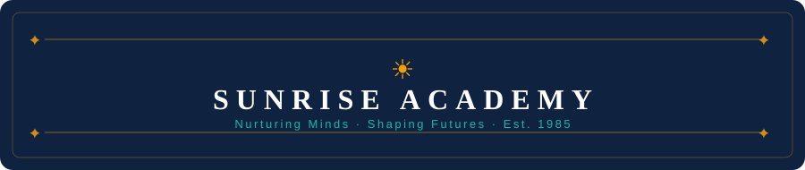

<!-- ╔══════════════════════════════════════════════════════════════╗ -->
<!--   H E A D E R                                                  -->
<!-- ╚══════════════════════════════════════════════════════════════╝ -->

<div align="center">

<br>



<br>

[](https://developer.mozilla.org/en-US/docs/Web/HTML)&nbsp;
[](https://developer.mozilla.org/en-US/docs/Web/CSS)&nbsp;
[](https://developer.mozilla.org/en-US/docs/Web/JavaScript)


*A modern, fully responsive K–12 school website — zero dependencies, pure web standards.*

<br>

</div>

---

## ◈ Overview

**Sunrise Academy** is a beautifully crafted, production-ready school website built entirely with vanilla HTML5, CSS3, and JavaScript — no frameworks, no build tools, no dependencies. It showcases a rich feature set including dynamic content rendering, an interactive calendar, a filterable course catalog, animated statistics, and a validated contact form, all wrapped in an elegant, accessible, responsive design system.

> _"Providing exceptional education that empowers students to become creative thinkers, compassionate leaders, and lifelong learners."_

---

## ✦ Features at a Glance

<table>
<tr>
<td width="50%">

**🎨 Design & UI**
- Pixel-perfect responsive layout (mobile, tablet, desktop)
- Cohesive design system with CSS custom properties
- Dual-font pairing — *Playfair Display* + *Inter*
- Smooth scroll, hover effects & micro-animations
- Accessible markup with ARIA attributes

</td>
<td width="50%">

**⚙️ Interactivity**
- Animated hero stat counters on scroll entry
- Interactive monthly calendar with event markers
- Filterable course grid by grade level (K–12)
- Event detail modal popup
- Sticky header with scroll-triggered styling

</td>
</tr>
<tr>
<td>

**📢 Dynamic Content**
- Announcements rendered from structured data
- Upcoming events list auto-populated from calendar data
- "New" badge tagging for recent announcements
- Category tagging on all events

</td>
<td>

**📬 Contact & Navigation**
- Contact form with full client-side validation
- Success feedback state after submission
- Hamburger menu for mobile navigation
- Smooth-scroll anchor navigation throughout

</td>
</tr>
</table>

---

## 📐 Page Sections

| # | Section | Description | Key Interactions |
|---|---------|-------------|------------------|
| 1 | **Hero** | Full-viewport welcome with tagline & animated stats | Scroll-triggered counters, CTA buttons |
| 2 | **Quick Links** | 3-card fast access panel | Smooth-scroll anchors |
| 3 | **About** | School history (est. 1985), mission & vision cards | Static, content-rich |
| 4 | **Announcements** | Latest news grid with "New" badges | Dynamically rendered from JS data |
| 5 | **Events** | Interactive monthly calendar + upcoming list | Month nav, event markers, modal popup |
| 6 | **Courses** | 12-course academic catalog | Grade-level filter dropdown |
| 7 | **Contact** | Info panel + validated contact form | Form validation, success state |
| 8 | **Footer** | Brand, quick links, resources, contact info | Social links, legal pages |

---

## 📚 Course Catalog

| Grade Band | Subjects Offered |
|:----------:|-----------------|
| **K – 2** | Language Arts · Basic Mathematics · Creative Arts |
| **3 – 5** | Intermediate English · Mathematics · Science Discovery |
| **6 – 8** | Pre-Algebra · Life Science · World History |
| **9 – 12** | Advanced Mathematics · Physics · Computer Science |

> Courses are filterable in real-time by grade band via a dropdown selector on the website.

---

## 🎨 Design System

**Colour Palette**

| Role | Name | Hex | Swatch |
|------|------|-----|--------|
| Primary | Navy | `#1a365d` |  |
| Primary Light | Steel Blue | `#2d4a7c` |  |
| Accent | Teal | `#0d9488` |  |
| Accent Light | Aqua | `#14b8a6` |  |
| Highlight | Gold | `#f59e0b` |  |
| Background | Soft White | `#f8fafc` |  |

**Typography**

| Role | Font | Weights |
|------|------|---------|
| Headings | [Playfair Display](https://fonts.google.com/specimen/Playfair+Display) — Serif | 600, 700 |
| Body / UI | [Inter](https://fonts.google.com/specimen/Inter) — Sans-serif | 300, 400, 500, 600, 700 |

---

## 🛠️ Technology Stack

| Layer | Technology | Details |
|-------|-----------|--------|
| Structure | **HTML5** | Semantic elements, ARIA roles, SEO meta |
| Presentation | **CSS3** | Custom properties, Grid, Flexbox |
| Behaviour | **JavaScript ES6** | Vanilla — no frameworks or libraries |
| Fonts | **Google Fonts** | Inter + Playfair Display |
| Icons | **Unicode Emoji** | Zero external icon dependencies |

> **Zero dependencies.** No npm, no bundler, no runtime required.  
> Open `index.html` and it works — on any device, any browser, offline.

---

## 📁 Project Structure

```
School Web Design/
│
├── 📄  index.html        →  All sections, semantic HTML, single page app
├── 🎨  styles.css        →  Full design system + responsive layouts
├── ⚙️   script.js         →  Data, DOM logic, calendar, form validation
├── 🖼️   logo.jpg          →  School logo asset
└── 📘  README.md         →  This file
```

---

## 🚀 Getting Started

```bash
# 1. Clone or download the repository
git clone https://github.com/your-username/sunrise-academy.git

# 2. Navigate to the project folder
cd sunrise-academy

# 3. Open in browser — that's it!
open index.html
```

> No Node.js · No npm install · No build step · Works offline ✓

**Or** simply download the ZIP, extract, and double-click `index.html`.

---

## 🧩 Customisation Guide

| What to change | Where to look |
|----------------|---------------|
| School name, tagline | `index.html` — `<header>` and `<section class="hero">` |
| Announcements data | `script.js` — `const announcements = [...]` |
| Events data | `script.js` — `const events = [...]` |
| Course catalog | `script.js` — `const courses = [...]` |
| Contact details | `index.html` — `<section class="contact">` + `<footer>` |
| Colours & fonts | `styles.css` — `:root { ... }` CSS variables block |
| Logo image | Replace `logo.jpg` with your own file |

---

## 📱 Responsive Breakpoints

| Viewport | Layout |
|----------|--------|
| `< 768px` | Single-column, hamburger nav, stacked cards |
| `768px – 1024px` | 2-column grid, condensed header |
| `> 1024px` | Full multi-column layout, expanded nav |

---

<!-- ╔══════════════════════════════════════════════════════════════╗ -->
<!--   F O O T E R                                                  -->
<!-- ╚══════════════════════════════════════════════════════════════╝ -->

<div align="center">

---


<br>

📍 &nbsp;123 Education Boulevard, Learning City, LC 12345 &nbsp;&nbsp;
📞 &nbsp;+1 (555) 123-4567 &nbsp;&nbsp;

<br>


*© 2025 Sunrise Academy · Built with ❤️ using pure HTML, CSS & JavaScript · For Educational Purposes*

<br>

</div>
